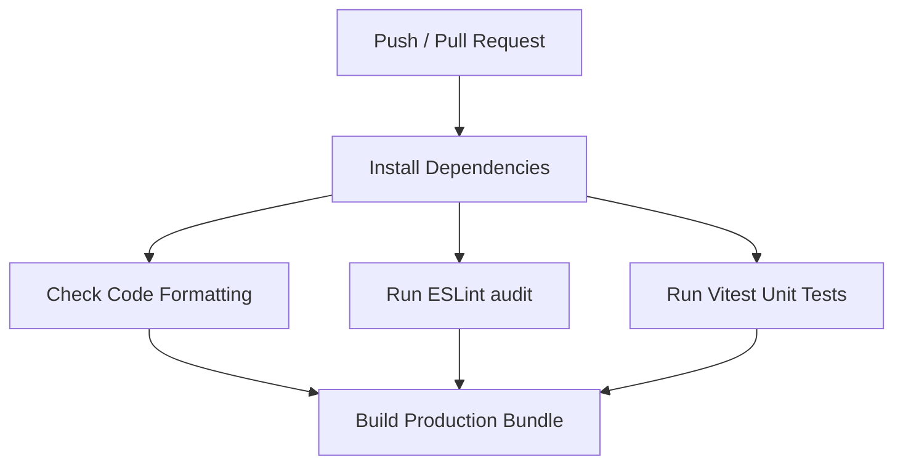

# PixFinder 📸

[](https://pixfinder-two.vercel.app/)
[](https://github.com/rafjas2/pixfinder/actions/workflows/ci.yml)
[](https://react.dev/)
[](https://tailwindcss.com/)
[](https://www.typescriptlang.org/)

PixFinder is a modern, high-performance image search application built with **React 19**, **Vite**, and **TypeScript**, styled with the next-generation **Tailwind CSS v4**. It provides a highly responsive, visually stunning interface to explore high-resolution photography powered by the [Pixabay API](https://pixabay.com/api/docs/).

The project is engineered for speed, security, and premium aesthetics, featuring a serverless API proxy for sensitive key protection and Edge-cached asset delivery.

---

## 🔗 Links & Preview

* **Live URL**: [https://pixfinder-two.vercel.app/](https://pixfinder-two.vercel.app/)
* **Repository**: [https://github.com/rafjas2/pixfinder](https://github.com/rafjas2/pixfinder)

> [!TIP]
> **To add a screenshot to this README**:
> Place a screenshot image (e.g. `screenshot.png`) inside your `public/` directory and embed it here:
> ``

---

## ✨ Features

* **⚡ Lightning-Fast Search**: Instant search feedback with asynchronous query loading and intelligent page caching.
* **🛡️ Secure API Proxy**: Implements a **Vercel Edge Function** (`/api/search`) to protect the Pixabay API key from being exposed to the client browser.
* **🌀 Advanced Caching**: Utilizes **TanStack Query** for robust server-state management, preventing duplicate network requests.
* **🖼️ High-Res Modal**: View images in crisp high-definition, complete with author metadata, stats (likes, downloads), and dynamic fallback avatars.
* **🚀 Core Web Vitals Optimized**:
  * Hero background image converted to **WebP** (reducing size by 89%).
  * Responsive image sizes with `loading="lazy"` to defer offscreen image loads.
* **🎨 Premium UI/UX**: Designed with smooth micro-animations, glassmorphism cards, and customized OKLCH palette colors.
* **🧹 Search Utility**: Clean, one-click reset option that instantly restores navigation states and URL query parameters.

---

## 🛠️ Technology Stack

* **Core**: React 19 (Functional Components, Hooks), Vite (Bundler & Dev Server), TypeScript 6
* **State & Data Routing**: TanStack Query v5, Zod (Schema Validation), React Router v7
* **Styling**: Tailwind CSS v4 (CSS-first engine), Lucide Icons
* **Code Quality & Testing**: Vitest, React Testing Library, ESLint 9 (Flat Config), Prettier
* **Deployment & Hosting**: Vercel (Edge Functions enabled)

---

## 🧠 Key Architectural & Security Decisions

### 1. Vercel Edge Proxy Function (`/api/search`)
To prevent the third-party Pixabay API key from being leaked to the client browser, all search requests are routed through a serverless **Vercel Edge Function**.
* **Edge Runtime**: Executed at the Edge closer to the user, ensuring sub-millisecond start times compared to cold-start traditional serverless containers.
* **Secure Environment**: Reads the `PIXABAY_API_KEY` entirely from server-side environment variables.

### 2. Intelligent Edge-Network Caching
To minimize API hits and stay well within quota limits, the Edge Proxy attaches optimized cache control headers to JSON payloads:
```typescript
'Cache-Control': 's-maxage=300, stale-while-revalidate=86400'
```
* Caches query results on Vercel's global CDN Edge for **5 minutes** (`s-maxage=300`).
* Serves stale results instantly for up to **24 hours** (`stale-while-revalidate=86400`) while revalidating the search query in the background.

### 3. Tailwind CSS v4 CSS-First Design System
This project leverages the brand-new **Tailwind CSS v4** styling engine, moving configuration from JS into native CSS.
* Declared custom tokens (spring easing transitions, custom breakpoints, font definitions) directly in [index.css](file:///c:/Users/rafal/Documents/GitHub/pixfinder/src/index.css) under the `@theme` directive.
* Employs modern **OKLCH** color format definitions for more uniform, perceptual color gradients and hover transitions.

### 4. End-to-End Type Safety & Data Validation
Third-party API endpoints can change without warning. To safeguard the UI:
* A **Zod** schema validates the payload structure returned from the proxy server.
* TypeScript types are inferred directly from the Zod validation schemas, ensuring complete type safety throughout our components.

---

## 📁 Architecture & Structure

```text
pixfinder/
├── .github/              # GitHub Actions workflows (CI pipeline)
├── api/                  # Vercel Serverless Functions (API Proxy)
├── public/               # Static public assets (manifest, robots, sitemap)
├── src/
│   ├── components/       # Reusable UI components (Hero, Search, Gallery, Modal)
│   ├── config/           # Global configuration parameters
│   ├── images/           # Optimized assets (Hero WebP background)
│   ├── lib/              # Logic & Utilities (API client, cn helper)
│   ├── types/            # Zod validation schemas & TS typings
│   ├── App.tsx           # Application layout and Routing declarations
│   └── index.css         # Tailwind directives & theme variables
├── eslint.config.js      # Modern ESLint v9 Flat Config
├── vite.config.ts        # Vite compiler configurations & path aliases
└── tsconfig.json         # Strict TypeScript compiler options
```

---

## ⚙️ Developer Experience & CI

A continuous integration pipeline is configured via GitHub Actions (`.github/workflows/ci.yml`) to run on every push and pull request. It enforces code health before any build:



### Script Commands

* `npm run dev` - Launches the Vite local dev server with Hot Module Replacement (HMR).
* `npm run build` - Performs TypeScript type-checking and bundles optimized assets.
* `npm run test` - Executes Vitest suite.
* `npm run test:ci` - Runs Vitest suite in CI mode (non-watching).
* `npm run lint` - Performs ESLint structural audit on the `src/` and `api/` source code.
* `npm run format:check` - Verifies that code format complies with the Prettier configurations.
* `npm run format` - Automatically formats all files using Prettier rules.

---

## 🚀 Local Setup

### Prerequisites
1. Install [Node.js](https://nodejs.org/) (v20+ recommended).
2. Obtain a free Pixabay API Key from [Pixabay API Docs](https://pixabay.com/api/docs/).

### Installation
1. **Clone the repository**:
   ```bash
   git clone https://github.com/rafjas2/pixfinder.git
   cd pixfinder
   ```
2. **Install dependencies**:
   ```bash
   npm install
   ```
3. **Configure Environment Variables**:
   Create a `.env` file in the root of the project:
   ```env
   VITE_PIXABAY_API_KEY=your_pixabay_api_key_here
   VITE_PIXABAY_API_URL=https://pixabay.com/api
   ```
4. **Start the application**:
   ```bash
   npm run dev
   ```

---

## 📄 License

This project is licensed under the MIT License - see the LICENSE file for details.

*Built & Designed with care by Rafal Jasinski*
